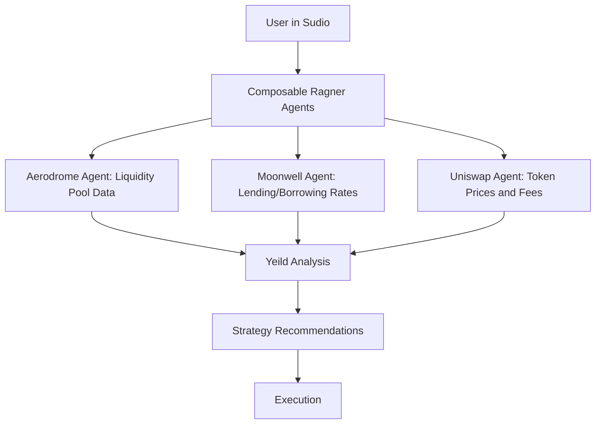

In software engineering, composition is a powerful concept. It allows for building complex systems from simple, interchangeable parts. Think Legos, Docker containers. in Ragner we apply this concept to AI infrastructure with the Composable AI stack

## What is Composability in AI?

Composability in AI refers to the ability to design and assemble modular AI components that can interact, function independently, and be reconfigured to meet specific use cases. This approach emphasizes:

<CardGroup cols={2}>
  <Card title="Flexibility" icon="arrows-rotate">
    Easily adapt or extend functionality to meet changing requirements
  </Card>
  <Card title="Scalability" icon="arrow-up-right-dots">
    Build systems that can grow without losing efficiency
  </Card>
  <Card title="Interoperability" icon="plug">
    Integrate seamlessly with diverse tools, APIs, and platforms
  </Card>
  <Card title="Efficiency" icon="gauge-high">
    Reuse and repurpose components to reduce development overhead
  </Card>
</CardGroup>

<Note>
  By focusing on composability, RAGNER simplifies the process of building AI
  agents tailored to unique needs.
</Note>

RAGNER embodies **Composable AI** by turning every API into a standardized, easily callable **building block**—complete with consistent documentation and usage patterns. This makes orchestrating AI modules (and traditional APIs) a frictionless, plug-and-play experience

### Interactive Example: AI Agent for Real-Time DeFi Yield Optimization

    Here's an interactive example of a composable AI DeFI Agent: it analyze real-time data from Aerodrome, Moonwell, and Uniswap, recommending optimal yield farming strategies.



#### Example Output: User Interaction

User Input:
“Invest $5,000 with a medium risk tolerance. What are the best options right now?”
Agent Response:

```
Based on your input, here are the top 3 yield farming strategies:
1. **Aerodrome Liquidity Pool (USDC/ETH)**
   - **APY**: 18.7%
   - **Risk**: Medium (volatility: low, platform TVL: $350M)

2. **Moonwell Lending Pool (WETH)**
   - **APY**: 12.2%
   - **Risk**: Low (stable borrowing demand, TVL: $500M)

3. **Uniswap Pool (DAI/USDT)**
   - **APY**: 15.3%
   - **Risk**: Medium (low impermanent loss, high trading fees)

Click below to execute your chosen strategy:
[Execute on Aerodrome] [Learn More]
```

### Ragner’s Composable Advantage in Action

Ragner’s composable approach allows you to build complex AI agents by assembling simple, interchangeable components. This flexibility enables you to:

- **Customize**: Tailor AI agents to your specific use cases.
- **Scale**: Assemble systems that can grow without losing efficiency or coherence.
- **Extensibility**: Seamlessly integrate with diverse tools, APIs, and platforms.
- **Efficiency**: Reuse and repurpose components, reducing development overhead.

#### Comparision

Here’s how Ragner simplifies this complex process:

| Traditional Workflow                        | Ragner Workflow                                                               |
| ------------------------------------------- | ----------------------------------------------------------------------------- |
| Integrating APIs manually for each platform | Turn and reuse APIs / Data Agents into reusable building blocks.              |
| Complex pipeline setups with fragile links  | Plug-and-play Pipes that handle ingestion to output.                          |
| Siloed analytics for each platform          | Unified analysis through AI Agents with shared context.                       |
| Rebuilding workflows for new platforms      | Add new platforms by swapping or adding Connectors.                           |
| Platform takes fees                         | Usage Revenue are distributed based on various agents used and their creators |

### Why Developers Love Ragner

- **Zero Friction in Integration:** Developers save weeks of effort by using Ragner's pre-built Connectors and API agents.
- **Rapid Prototyping:** By reusing already existing Agents, new features like impermanent loss calculators or multi-chain support can be added quickly.
- **Cross-Platform Orchestration:** Developers can extend the agent to monitor other DeFi platforms like Curve or Aave without breaking the existing architecture.

<Info>
  {" "}
  By using Ragner’s **Composable AI** stack, developers can deploy intelligent, scalable,
  and modular DeFi AI agents that adapt to a rapidly evolving landscape, unlocking
  unprecedented value for users.{" "}
</Info>
