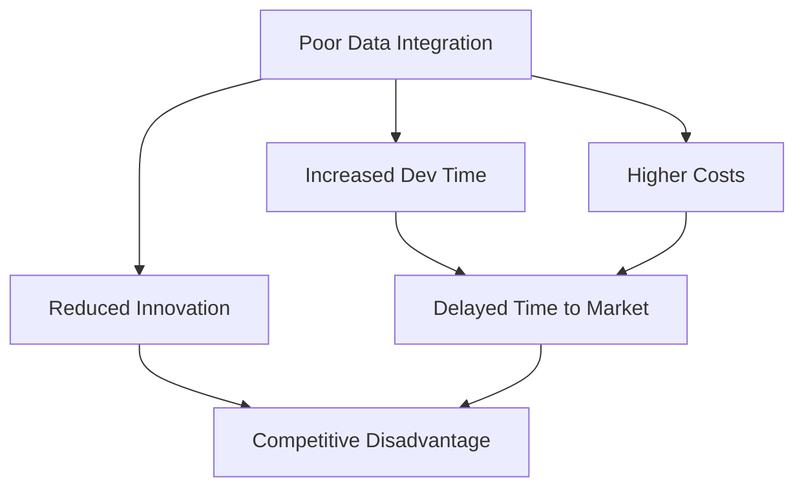

## The Current Integration Crisis

Despite the promise of standardized endpoints and developer-friendly docs, the real-world experience is often a tangle of outdated references, inconsistent formats, and endless manual coding.

<Note>
  While APIs should empower innovation, poor documentation and unwieldy
  integration processes end up slowing it down.
</Note>

### **The Modern Dilemma of Data Integration**

Developers today face a seemingly endless list of challenges when dealing with data integration:

- Outdated or incomplete documentation.
- Inconsistent endpoint structures.
- Excessive time spent on manual custom wrappers creation and maintenance.
- Mundane, repetitive tasks hamper creativity and innovation.

These issues quickly turn a “few hours” integration into days (or weeks) of debugging. When you multiply that across 20+ endpoints for a single enterprise project, the overhead becomes staggering.

<Note>
  Developers spend 60% of integration time on fixing or reverse-engineering poor
  documentation.
</Note>

### The AI Creation Challenges

AI agents require seamless communication with external systems to function effectively. However, developers face significant friction in enabling these integrations:

**Current state of Agent Development:**

Developers must manually review documentation, write custom wrappers, turn wrappers
into AI-executable tools, and repeat this process for each system integration.

<Warning>
  {" "}
  This is how most AI Agents are built today- as you can see it's not efficient
</Warning>

This creates a massive bottleneck in development, slowing the deployment of autonomous agents and limiting their practical applications.

**It can be better**

The rise of autonomous AI agents introduces new integration requirements:

- Real-time Performance: Agents need immediate data access
- Reliability: Failed integrations can break entire agent workflows
- Scalability: Agents must interact with multiple endpoints simultaneously
- Standardization: Consistent interfaces are crucial for agent operation

### Enterprise Challenges

For enterprises that manage dozens (or even hundreds) of APIs, the problem compounds:

- **Resource Allocation**: Senior developers get pulled into routine integration tasks
- **Maintenance Overhead**: Constant updates and deprecations create ongoing burden
- **Integration Sprawl**: Managing 20+ API integrations becomes exponentially complex
- **Adoption Barriers**: Complex integration requirements discourage API adoption

**Business Impact**:
The inefficiencies caused by poorly designed or maintained communication protocols extend far beyond the engineering team, affecting the business at large:

The compounding effects of these inefficiencies can lead to missed market opportunities, escalated costs, and a significant erosion of competitive edge in fast-moving industries.
